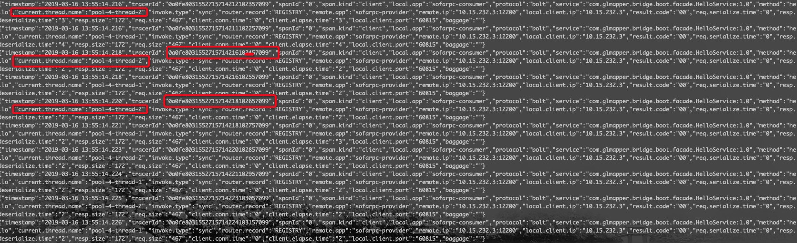
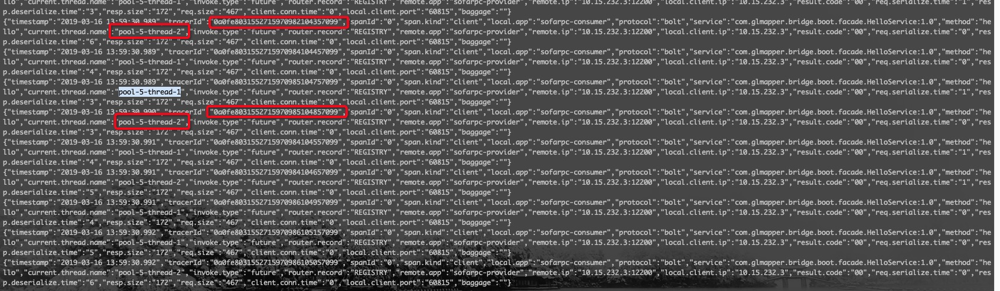
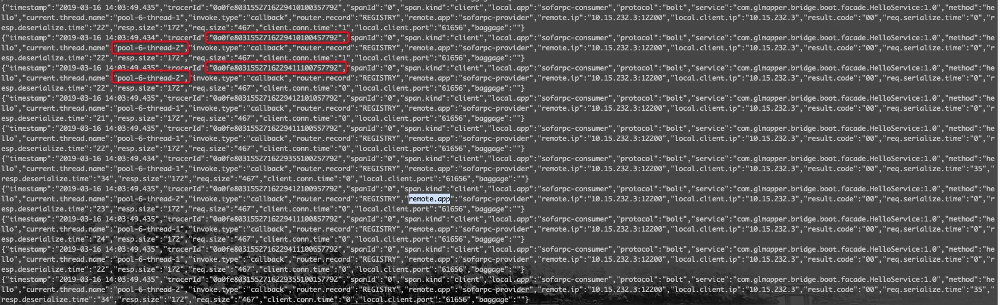

# SOFATracer 在线程池、异步调用场景下的分析

## 问题背景

「在批处理时，我有一个任务（在同一个线程中）可能要处理很多条数据，每条数据处理逻辑可能会发起 rpc 调用，如果所有数据处理时使用的都是一个 tracerId，那定位问题就会非常困难。」

关于这个问题最初想到的有两个：

* 异步场景下，callback 回来之前又发起另外一次 rpc 调用，从而造成数据污染
* 在线程池场景下，存在线程复用，同样是在异步场景下，一个 rpc 请求结束在收到响应之前，此线程被分配给另外一个请求，从而造成脏数据。

## 在同一线程中发起多次 rpc 调用

这里需要考虑两种情况，一种是同步调用，另外一种是异步调用。

### 同步调用

同步调用，每次 rpc 都会等到得到返回结果之后才会进行下一次调用，如下：

* 案例

```java
@SofaReference(binding = @SofaReferenceBinding(bindingType = "bolt"))
private HelloService helloService;
/**
* 模拟批量处理，同步调用
*/
public void singleThread(){
  for (int i=0;i<10;i++){
  	helloService.SayHello("sss");
  }
}
```

这种情况下每次发起的 rpc 调用（即一次数据处理）都会产生一个新的 tracerId ;（SOFARPC 和 Dubbo 埋点情况相同）。

* 结果日志

```
{"timestamp":"2019-03-16 10:16:12.151","tracerId":"0a0fe8031552702571956101953265","spanId":"0","span.kind":"client","local.app":"sofarpc-consumer","protocol":"bolt","service":"com.glmapper.bridge.boot.facade.HelloService:1.0","method":"hello","current.thread.name":"pool-5-thread-2","invoke.type":"future","router.record":"REGISTRY","remote.app":"sofarpc-provider","remote.ip":"10.15.232.3:12200","local.client.ip":"10.15.232.3","result.code":"00","req.serialize.time":"0","resp.deserialize.time":"193","resp.size":"172","req.size":"467","client.conn.time":"0","local.client.port":"55796","baggage":""}
{"timestamp":"2019-03-16 10:16:12.151","tracerId":"0a0fe8031552702571963104753265","spanId":"0","span.kind":"client","local.app":"sofarpc-consumer","protocol":"bolt","service":"com.glmapper.bridge.boot.facade.HelloService:1.0","method":"hello","current.thread.name":"pool-5-thread-2","invoke.type":"future","router.record":"REGISTRY","remote.app":"sofarpc-provider","remote.ip":"10.15.232.3:12200","local.client.ip":"10.15.232.3","result.code":"00","req.serialize.time":"1","resp.deserialize.time":"185","resp.size":"172","req.size":"467","client.conn.time":"0","local.client.port":"55796","baggage":""}
{"timestamp":"2019-03-16 10:16:12.151","tracerId":"0a0fe8031552702571958103153265","spanId":"0","span.kind":"client","local.app":"sofarpc-consumer","protocol":"bolt","service":"com.glmapper.bridge.boot.facade.HelloService:1.0","method":"hello","current.thread.name":"pool-5-thread-2","invoke.type":"future","router.record":"REGISTRY","remote.app":"sofarpc-provider","remote.ip":"10.15.232.3:12200","local.client.ip":"10.15.232.3","result.code":"00","req.serialize.time":"0","resp.deserialize.time":"192","resp.size":"172","req.size":"467","client.conn.time":"0","local.client.port":"55796","baggage":""}
```

每次均会产生新的 tracerId

### 异步调用

> 异步调用，每次 rpc调用请求出去之后不会等待到结果返回之后才去发起下一次处理，这里有个时间差，在前一个rpc 调用的 callback 回来之前，有一个新的 rpc 请求发起，此时当前线程中的 TracerContext 没有被清理，则spanId 会自增，tracerId 相同


对于上面这种情况，**不会等到 callback 回来之后，调用 cr 阶段才会清理，而是提前就会清理当前线程的 tracerContext 上下文。**

* SOFARPC 实现

com.alipay.sofa.rpc.tracer.sofatracer.RpcSofaTracer#clientBeforeSend

```java
clientSpan = sofaTraceContext.pop();
if (clientSpan != null) {
  // Record client send event
  clientSpan.log(LogData.CLIENT_SEND_EVENT_VALUE);
}
//将当前 span 缓存在 request 中,注意:这个只是缓存不需要序列化到服务端
rpcInternalContext.setAttachment(RpcConstants.INTERNAL_KEY_TRACER_SPAN, clientSpan);
if (clientSpan != null && clientSpan.getParentSofaTracerSpan() != null) {
  //restore parent
  sofaTraceContext.push(clientSpan.getParentSofaTracerSpan());
}
```

* 扩展的 Dubbo 埋点实现

[com.alipay.sofa.tracer.plugins.dubbo.DubboSofaTracerFilter#doClientFilter](https://github.com/alipay/sofa-tracer/pull/183/files#diff-1a6262d3bb3f419358ea61ac030e696c)<br /><br />
```java
 SofaTraceContext sofaTraceContext = SofaTraceContextHolder.getSofaTraceContext();
 SofaTracerSpan clientSpan = sofaTraceContext.pop();
   if (clientSpan != null) {
   // Record client send event
   sofaTracerSpan.log(LogData.CLIENT_SEND_EVENT_VALUE);
 }
 // 将当前 span 缓存到TracerSpanMap中
 TracerSpanMap.put(getTracerSpanMapKey(invoker), sofaTracerSpan);
 if (clientSpan != null && clientSpan.getParentSofaTracerSpan() != null) {
   	//restore parent
 		sofaTraceContext.push(clientSpan.getParentSofaTracerSpan());
 }
 CompletableFuture<Object> future = (CompletableFuture<Object>) RpcContext.getContext().getFuture();
 future.whenComplete((object, throwable)-> {
 	if (throwable != null && throwable instanceof TimeoutException) {
 		dubboConsumerSofaTracer.clientReceiveTagFinish(sofaTracerSpan, "03");
 	}
 });
```

在 callback 之前清理掉 TracerContext ，将对后面的调用不会产生任何影响。

* 案例

```java
@SofaReference(binding = @SofaReferenceBinding(bindingType = "bolt",invokeType = "future"))
    private HelloService helloService;
    /**
     * 模拟批量处理，同步调用
     */
    public void singleThreadAsync(){
        for (int i=0;i<10;i++){
            helloService.hello();
        }
    }
```

* 结果日志

```
{"timestamp":"2019-03-16 13:33:48.916","tracerId":"0a0fe8031552714428908101957099","spanId":"0","span.kind":"client","local.app":"sofarpc-consumer","protocol":"bolt","service":"com.glmapper.bridge.boot.facade.HelloService:1.0","method":"hello","current.thread.name":"http-nio-8081-exec-4","invoke.type":"future","router.record":"REGISTRY","remote.app":"sofarpc-provider","remote.ip":"10.15.232.3:12200","local.client.ip":"10.15.232.3","result.code":"00","req.serialize.time":"0","resp.deserialize.time":"6","resp.size":"172","req.size":"467","client.conn.time":"0","local.client.port":"60815","baggage":""}
{"timestamp":"2019-03-16 13:33:48.916","tracerId":"0a0fe8031552714428910102057099","spanId":"0","span.kind":"client","local.app":"sofarpc-consumer","protocol":"bolt","service":"com.glmapper.bridge.boot.facade.HelloService:1.0","method":"hello","current.thread.name":"http-nio-8081-exec-4","invoke.type":"future","router.record":"REGISTRY","remote.app":"sofarpc-provider","remote.ip":"10.15.232.3:12200","local.client.ip":"10.15.232.3","result.code":"00","req.serialize.time":"0","resp.deserialize.time":"5","resp.size":"172","req.size":"467","client.conn.time":"0","local.client.port":"60815","baggage":""}
{"timestamp":"2019-03-16 13:33:48.916","tracerId":"0a0fe8031552714428911102157099","spanId":"0","span.kind":"client","local.app":"sofarpc-consumer","protocol":"bolt","service":"com.glmapper.bridge.boot.facade.HelloService:1.0","method":"hello","current.thread.name":"http-nio-8081-exec-4","invoke.type":"future","router.record":"REGISTRY","remote.app":"sofarpc-provider","remote.ip":"10.15.232.3:12200","local.client.ip":"10.15.232.3","result.code":"00","req.serialize.time":"0","resp.deserialize.time":"4","resp.size":"172","req.size":"467","client.conn.time":"0","local.client.port":"60815","baggage":""}
```

每次均会产生新的 tracerId

## 基于线程池

就目前来说，不管是 SOFARPC 还是 Dubbbo 的埋点实现，在使用单线程或者线程池时，情况是一样的：
* 同步调用，线程池中分配一个线程用于处理 rpc 请求，在请求结束之前会一直占用线程；此种情况下不会造成下一个 rpc 请求错拿上一个请求的 tracerContext 数据问题
* 异步调用，由于异步回调并非是在 callback 中来清理上下文，而是提前清理的，所以也不会存在数据串用问题。
* callback 异步回调，这个本质上就是异步调用，所以处理情况和异步调用相同。

<a name="21b9b424"></a>
### 线程池同步调用

* 案例

```java
private static ExecutorService executorService = Executors.newFixedThreadPool(2);

    @SofaReference(binding = @SofaReferenceBinding(bindingType = "bolt"))
    private HelloService helloService;

    public void multiThread(){
        for (int i=0;i < 10;i++){
            executorService.submit(new TaskRunnable());
        }
    }

    class TaskRunnable implements Runnable{
        @Override
        public void run() {
            helloService.hello();
        }
    }
```

* 日志结果



tracerId 每次会产生新的，线程不会出现复用情况，不会出现脏数据。

### 线程池异步调用

* 案例

```java
private static ExecutorService executorService = Executors.newFixedThreadPool(2);

    @SofaReference(binding = @SofaReferenceBinding(bindingType = "bolt",invokeType = "future"))
    private HelloService helloService;

    public String multiThreadAsync(){
        for (int i=0;i < 10;i++){
            executorService.submit(new TaskRunnable());
        }
        return "success";
    }

    class TaskRunnable implements Runnable{
        @Override
        public void run() {
            helloService.hello();
        }
    }
```

* 日志结果



* callback 



tracerId 每次会产生新的，线程不会出现复用情况，不会出现脏数据。

## 前提条件

对于上述所有案例，对于每个 rpc 请求生成 tracerId 都不同，其前提条件是此次调用不存在 parentSpan
* 同一线程情况下
  * 存在 parentSpan ，所有的 rpc 请求会拥有相同的 tracerId，spanId (假设 parentSpan 的id是0)将会递增（0.1，0.2，0.3...）
  * 如果不存在 parentSpan ，则每次 rpc 请求将会作为新链路的发起端
* 线程池
  * 除非手动传递 tracer 上下文到线程池中，一般情况下，线程池中的第一个请求发起将会作为链路的起点，即产生新的 tracerId ，且 spanId 为 0。


